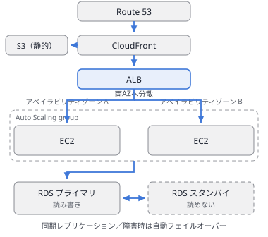
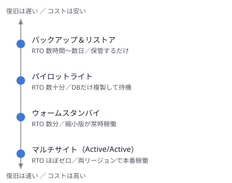

# 第12章 第2分野：弾力性に優れたアーキテクチャの設計（出題比率 26%）

> **章の要点**：障害発生時にもサービスを継続稼働させ、トラフィックの変動にも自律的に適応するアーキテクチャの設計を扱う。単一障害点（SPOF: Single Point of Failure）の徹底的な排除、非同期キュー等による疎結合化、およびビジネス要件（RTO/RPO）に応じた最適なディザスタリカバリ（DR）戦略の選定が核心となる。

---

## 12.1 スケーリング戦略

### スケールアウトとスケールアップの選択基準
| ワークロードの課題・状況 | 推奨されるアーキテクチャ・対応策 |
|---|---|
| アクセス負荷が大きく変動し、高い耐障害性・可用性が求められる | **水平スケーリング（スケールアウト）**：Auto Scalingグループ ＋ ELB ＋ マルチAZ配置を基本設計とする。 |
| リレーショナルデータベースの書き込み（Write）処理がボトルネック | インスタンスクラスの変更による**垂直スケーリング（スケールアップ）**、Amazon Auroraへの移行、またはアプリケーション層でのシャーディング。 |
| データベースの読み取り（Read）処理がボトルネック | **リードレプリカの追加**、または**Amazon ElastiCache（Redis/Memcached）**やDAXによるインメモリキャッシュの導入。 |
| 予測不能な急激なスパイクが発生し、EC2の起動時間（数分）では追従できない | Auto Scaling**ウォームプール**、**予測スケーリング**の活用、またはAWS Lambda/ECS on Fargate等の高速起動基盤への移行。 |

### コンポーネント別のスケーリング手法
- **Web/アプリケーション層**：EC2 Auto Scalingグループ（ターゲット追跡ポリシー、ステップスケーリングポリシー）。
- **コンテナ層**：Amazon ECSのService Auto Scaling（タスク数の動的増減）。
- **サーバーレス層**：AWS Lambda（リクエスト数に応じてミリ秒単位で同時実行数を自動調整。アカウント単位の同時実行上限に留意）。
- **データベース層**：Amazon DynamoDB（オンデマンドキャパシティモードまたはAuto Scaling）、Amazon Aurora（リードレプリカのAuto Scaling、Aurora Serverless v2）。

### ステートレスアーキテクチャ（水平スケーリングの前提条件）
- アプリケーションサーバーがローカルディスクやメモリ内にセッション情報や状態（State）を保持していると、安全なスケールイン（インスタンス削除）や自由な負荷分散が行えない。
- **セッション情報の外部化**：**Amazon ElastiCache**や**Amazon DynamoDB**へセッションを保存する。
- **共有ファイルの外部化**：インスタンスローカルではなく、**Amazon EFS**や**Amazon S3**へ共有ストレージをオフロードする。

---

## 12.2 疎結合アーキテクチャ（Decoupling）

コンポーネント間の強結合を解消することで、一箇所の障害がシステム全体へ波及するカスケード障害を防止し、各コンポーネントが独立してスケールできる環境を実現する。

| アーキテクチャ上の課題 | 解決策・デザインパターン |
|---|---|
| 後続の処理遅延や障害によって、前段のWebサーバーまでリクエストが詰まり停止する | 前後間に**Amazon SQS**を配置し、メッセージをバッファリングして非同期処理化する。 |
| 1つの業務イベントに対して、複数の異なる独立システムが同時に処理を実行したい | **Amazon SNSトピックから複数SQSキューへのファンアウト構成**、または**Amazon EventBridge**によるイベントルーティング。 |
| クライアントが特定サーバーの固定IPアドレスを直接参照して通信している | **Elastic Load Balancing (ELB)**、**Amazon Route 53**、または**AWS Cloud Map（サービスディスカバリ）**を仲介させる。 |
| 複数の処理ステップ、分岐、エラーハンドリング、再試行ロジックが複雑に絡み合っている | **AWS Step Functions**によるステートマシンベースの分散ワークフローオーケストレーション。 |
| 同期HTTP呼び出しのタイムアウトが頻発している | 処理受付と重いバッチ処理を分離し、キューイング後に非同期でポーリングまたはコールバック通知を行う設計へ変更する。 |

---

## 12.3 サーバーレステクノロジーの活用

### 主要コンポーネント
- **リクエスト受付・ルーティング**：Amazon API Gateway、Application Load Balancer、Amazon CloudFront
- **コンピューティング・オーケストレーション**：AWS Lambda、AWS Step Functions、AWS Fargate
- **ストレージ・データストア**：Amazon S3、Amazon DynamoDB、Amazon Aurora Serverless
- **非同期メッセージング**：Amazon SQS、Amazon SNS、Amazon EventBridge、Amazon Kinesis
- **ユーザー認証**：Amazon Cognito

### サーバーレスの採用判断基準
- **推奨されるケース**：「サーバー管理やパッチ適用の運用負荷を極小化したい」「アイドル時のコストをゼロに抑えたい」「トラフィックが断続的または予測困難である」「少人数で迅速にプロダクトを立ち上げたい」。
- **非適合となるケース**：「15分を超える連続実行が必要（Lambdaの上限）」「常時高負荷で稼働し続けるためEC2（RI/Savings Plans）の方がコスト効率が良い」「OSカーネルレベルのチューニングや特殊なファイルシステムが必要」「特定のオンプレミス商用ライセンス要件がある」。

---

## 12.4 イベント駆動型アーキテクチャ（Event-Driven Architecture）

### イベントソースと典型的な構成パターン
| イベントの発生元 | 典型的な連携構成 |
|---|---|
| Amazon S3への新規ファイル配置 | S3イベント通知 → AWS Lambda（軽量加工）／Amazon SQS（大量バッチ処理）／Amazon SNS（複数宛先） |
| Amazon DynamoDBのデータ変更 | **DynamoDB Streams** → AWS Lambda（集計・検索エンジン同期） |
| AWSリソースの状態変化、GuardDutyの脅威検知 | **Amazon EventBridge** → AWS Lambda / SNS通知 / Systems Manager Automation（自動修復） |
| 定期的なスケジュール実行（Cron処理） | **Amazon EventBridge Scheduler** → AWS Lambda / Step Functions / ECSタスク起動 |
| 大量のクリックストリームやIoTテレメトリデータ | **Amazon Kinesis Data Streams** → Kinesis Data Firehose / Lambda / Managed Service for Apache Flink |
| SaaSアプリケーション（Salesforce等）のデータ更新 | **EventBridge パートナーイベントバス** → 社内AWS処理基盤 |

### 障害耐性とデッドレターキュー（DLQ）
- **非同期Lambdaの再試行**：非同期呼び出しで失敗した場合、自動的に2回再試行される。それでも失敗したイベントを保全するために、**デッドレターキュー（DLQ）**または**Lambda Destinations（送信先設定）**を定義する。
- **SQSのDLQ**：ワーカーが指定回数（`maxReceiveCount`）受信しても正常に削除（完了）できなかったメッセージを隔離用DLQへ自動退避し、後続メッセージの処理停止（ポイズンピル問題）を防止する。
- **運用設計**：メッセージの欠落を防ぐ要件ではDLQの導入が不可欠となるが、単に隔離するだけでなく、**CloudWatchアラームによるDLQ滞留検知、原因調査、および再処理（Redrive）の運用手順**を整備することが求められる。

---

## 12.5 高可用性（HA）と耐障害性（Fault Tolerance）

### 単一障害点（SPOF）排除の基本パターン
- **単一AZ構成の排除**：マルチAZ配置の適用（ALB ＋ Auto Scaling、Amazon RDSマルチAZ、Amazon EFS、AZごとのNAT Gateway配置）。
- **単一リージョン構成の排除**：大規模広域災害に備えたマルチリージョン展開（Route 53 DNSフェイルオーバー、Auroraグローバルデータベース、S3クロスリージョンレプリケーション、DynamoDBグローバルテーブル）。
- **単一インスタンスの排除**：Auto Scalingグループによる最低2台以上の分散配置（`Min=2` 以上）。
- **手動オペレーションの排除**：AWS CloudFormation等のIaCによる環境の再現性担保。

**図：** 多くの設問の正解は、この形か、この形の一部です。**各層をAZ単位で冗長化**し、セッションはEC2に置かずElastiCacheやDynamoDBへ外出しして、EC2をいつでも入れ替えられる状態（ステートレス）に保ちます。RDSのスタンバイは**読み取りには使えない**点が頻出のひっかけです。

### ディザスタリカバリ（DR）戦略の4類型

災害対策の4つのアプローチは、**目標復旧時間（RTO）**と**目標復旧時点（RPO）**の要件、および許容コストのトレードオフによって決定される。

| 戦略 | 概要・構成例 | RTO（復旧所要時間）の決定要因 | RPO（許容データ損失）の決定要因 | コスト水準 |
|---|---|---|---|---|
| **バックアップ＆リストア** | データバックアップのみを別リージョンに定期転送し、災害発生後にインフラをゼロからプロビジョニングして復元 | 新規環境の構築時間およびデータリストア時間（**数時間〜数日**） | **バックアップの取得・転送頻度**（通常は数時間〜日単位） | **最も安価** |
| **パイロットライト** | データベース等の**中核データストアのみを別リージョンへ常時複製・起動**し、コンピュート層は停止またはAMI/テンプレート状態で待機 | アプリケーションサーバーの起動・プロビジョニング時間（**数十分〜1時間程度**） | データベースの非同期レプリケーション遅延（**数秒〜数分**） | 安価 |
| **ウォームスタンバイ** | 本番環境の**縮小版（最小限のフリート）を別リージョンで常時稼働**させておき、災害時にAuto Scalingでフルスケールへ拡張 | トラフィック切り替えおよびサーバーのスケールアウト時間（**数分〜数十分**） | データベースの非同期レプリケーション遅延（**数秒〜数分**） | 中程度 |
| **マルチサイト（アクティブ/アクティブ）** | **複数のリージョンで完全な本番環境を常時アクティブ稼働**させ、トラフィックを常時分散処理 | DNSまたはエッジルーティングのフェイルオーバー時間（**数秒〜数分**、ほぼ即時） | レプリケーション同期度（グローバルDB等で**ほぼゼロ**） | **最高** |

**図：** 下にいくほど**復旧は速く、コストは高く**なります。設問のRTO/RPO要件を満たす戦略のうち、**最も下に行かずに済むもの**が正解です。「データ損失は許されない（RPOほぼゼロ）」ならマルチサイトやAuroraグローバルデータベース、「数分で復旧」ならウォームスタンバイが目安になります。

**RTOとRPOの本質的理解**：
- **RPO（Recovery Point Objective: 目標復旧時点）**：許容できるデータ損失の時間的幅。**バックアップの取得頻度**、または**データレプリケーション方式（同期か非同期か）とその伝搬遅延**によって決定される。
- **RTO（Recovery Time Objective: 目標復旧時間）**：被災からサービスが再開するまでに許容されるダウンタイム。**環境の起動手順がどこまで自動化・事前プロビジョニングされているか**によって決定される。
- **試験における選択指針**：設問の「許容されるダウンタイム」はRTO、「許容されるデータ損失量」はRPOを指す。**提示されたRTO/RPOの要件を満たす選択肢の中で、最もコストが低い戦略を選択する**ことが原則となる。

---

## 12.6 設計ケーススタディ：障害種別に応じた多重防御アーキテクチャ

### 要件定義
- Application Load Balancer ＋ Auto Scaling（EC2） ＋ Amazon RDS の3層Webアプリケーション。
- 「単一インスタンス障害」「AZ全体の障害」「リージョン規模の災害」「管理者によるデータの誤削除・誤更新」の各シナリオに備える。
- ビジネス目標：**RTO 1時間以内、RPO 15分以内**。要件を満たす中でインフラコストを最小化する。

### 前提・制約条件
1. どのような障害シナリオにおいても、1時間以内にサービスを再開できること（RTO ≤ 1時間）。
2. 失われるデータは最大でも15分前までの範囲に収めること（RPO ≤ 15分）。

### 障害種別ごとの有効な対策と無効な対策の整理

| 想定される障害 | 有効な設計・対策 | 効果のない誤った対策とその理由 |
|---|---|---|
| **EC2インスタンス障害** | Auto Scaling（複数AZに最小2台以上配置） ＋ ALBによるヘルスチェック | **RDSマルチAZ**：データベース層の高可用性機能であり、アプリケーション層の障害復旧には寄与しない。 |
| **アベイラビリティゾーン（AZ）障害** | 複数AZにまたがるAuto Scalingグループ、**Amazon RDSマルチAZ（同期スタンバイ）**、AZごとのNAT Gateway配置 | **RDSリードレプリカ**：非同期複製であり、障害時の自動フェイルオーバー機能を持たないため手動昇格が必要となる。 |
| **リージョン規模の広域災害** | セカンダリリージョンへの**クロスリージョンリードレプリカ**、別リージョン構築用のCloudFormationテンプレート、Amazon Route 53フェイルオーバー | **マルチAZ配置**：単一リージョン内の複数データセンター障害に備えるものであり、リージョン全体の被災時には全滅する。 |
| **人為的ミス（誤削除・テーブル破壊）** | **RDS自動バックアップによるポイントインタイムリカバリ（PITR）**、手動スナップショット、S3バージョニング | **RDSマルチAZおよびリードレプリカ**：**マスターで実行された削除コマンド（`DROP TABLE` 等）は、スタンバイやレプリカにも即座に複製・実行される**ため保護できない（最頻出の落とし穴）。 |

### 採用アーキテクチャ
- **コンピュート層**：2つのAZにまたがるAuto Scalingグループ（ALBヘルスチェック連動）。
- **データベース層（同一リージョン内）**：**Amazon RDSマルチAZ配置**を採用し、AZ障害時に数分で自動フェイルオーバーを実施。さらに**自動バックアップ（保持期間有効化）によるポイントインタイムリカバリ（PITR）**を設定し、5分前までの任意の時点への復元を可能にして誤削除対策とする（RPO 15分を達成）。
- **リージョン間DR（クロスリージョン）**：別リージョンへ**クロスリージョンリードレプリカ**を作成（非同期複製の遅延は通常秒単位であり、リージョン被災時のRPO 15分を満たす）。セカンダリリージョン側のインフラ（VPC、ALB、Auto Scalingグループ）は**AWS CloudFormationテンプレート**として準備しておき、被災時にレプリカをマスターへ昇格してスタックを展開、Route 53 DNSを切り替える（RTO 1時間以内を達成）。

### 運用上の留意点
- クロスリージョンリードレプリカのプライマリへの昇格処理は標準では**手動操作**（またはLambda/EventBridgeによるカスタム自動化）となる。RTO 1時間を確実に達成するためには、昇格手順とDNS切り替え手順の自動化ランブックを事前に検証しておく必要がある。

### 条件変更時の再評価

| 変更された要件 | 設計変更点 | 技術的根拠 |
|---|---|---|
| リージョン災害時でも「RTO 5分・RPO 1分以内」が要求される | **Amazon Auroraグローバルデータベース**を採用し、ウォームスタンバイ構成とする | 通常のバックアップやCloudFormationからの再構築では、プロビジョニング時間だけでRTO 5分を超過するため。Auroraグローバルデータベースは通常1秒未満の物理レプリケーションと1分未満の高速昇格を提供する。 |
| 可用性要件（AZ/リージョン冗長）はなく、誤操作・ランサムウェアからの復旧のみが求められる | 単一AZ RDS ＋ 自動バックアップ（PITR） ＋ S3オブジェクトロック | 高可用性（マルチAZ）は論理的なデータ破壊には効果がなく、要件を満たす最小コストはバックアップとなるため。 |
| データ損失が1件たりとも許されない（RPO = 0） | 同一リージョン内の**RDSマルチAZ（完全同期書き込み）**を前提とする | 複数リージョン間をまたぐレプリケーションは光速の物理的制約から非同期通信とならざるを得ず、被災直前の数秒の未転送データ損失（RPO > 0）を完全にゼロにすることはできない。 |

---

[目次に戻る](./README.md) ／ 次の章：[第13章 高パフォーマンスなアーキテクチャの設計](./13-performance.md)

